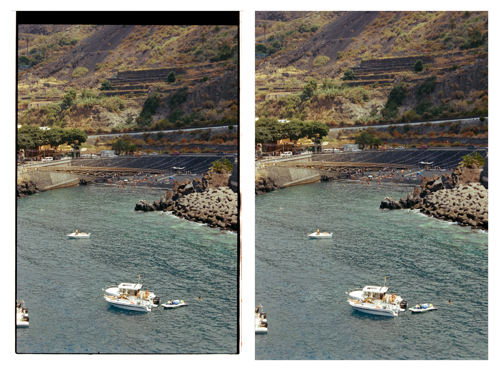
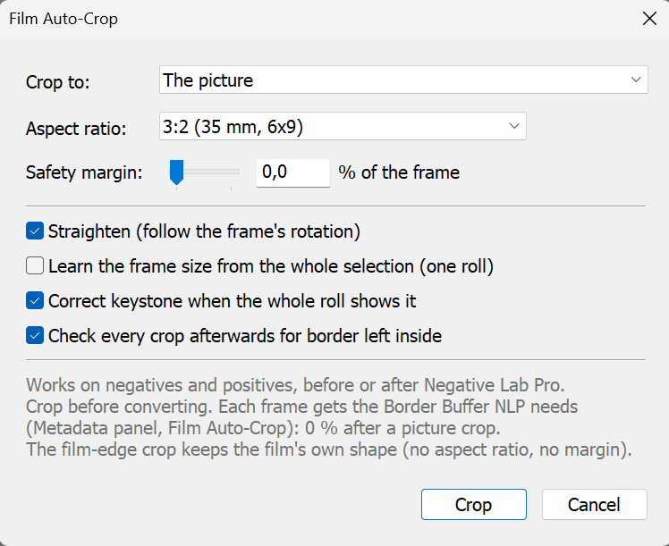

# Film Auto-Crop for Lightroom Classic

Auto-crop scanned film in Lightroom Classic. It finds the edge of the
picture, straightens it and crops it, on negatives and positives, before or
after Negative Lab Pro. It can also keep the film rebate in the crop, and it
tells you which Border Buffer Negative Lab Pro needs for each frame.

## Features

- **Finds the picture edge, not the border.** It tells film rebate, the film
  holder or mask, the scan bed and light leaks apart from the picture, on all
  four sides.
- **Straightens.** The crop follows the frame's rotation, up to ±6°.
- **Crops to a film format:** 3:2 (35 mm, 6×9), 4:3 (6×4.5, half frame),
  5:4 (6×7), 1:1 (6×6), 65:24 (XPan), or the frame's own proportions.
- **Keep-rebate mode:** crops to the edge of the film instead, with rebate
  and sprocket edges in and holder and scan bed out, for the full-frame
  film look.
- **Negative Lab Pro Border Buffer:** gives the buffer each frame needs, per
  photo and for the whole selection. It can also measure without cropping, if
  you prefer to hand NLP the whole scan.
- **Works per roll:** learns the roll's frame size from the clear frames and
  uses it on difficult ones (dark shadows, holder over the picture, bad
  advance).
- **Keystone, when the whole roll shows it:** corrects the camera-to-film
  angle with Lightroom's Transform sliders, measured on one frame and
  applied to the roll.
- **Checks itself:** after cropping it looks again for border left inside.
  Frames worth a look go to a collection; frames with no film frame (a digital
  photo, a blank leader) are left untouched.
- **Safe:** only crop settings (and, for keystone, two Transform sliders) are
  ever written. Negative Lab Pro's own settings are never touched. Every step
  can be undone.
- Pure Lua: no external programs, no internet access.

## Install

1. Download this repository (Code > Download ZIP) and unzip it.
2. Put the `FilmAutoCrop.lrplugin` folder somewhere permanent.
3. In Lightroom Classic: **File > Plug-in Manager > Add**, then choose the
   `FilmAutoCrop.lrplugin` folder.

## Use

Select your frames in the Library, then **Library > Plug-in Extras**
(or **File > Plug-in Extras**):

- **Film Auto-Crop...** opens the options, then crops.
- **Film Auto-Crop (last settings)** crops straight away with the last options.

### Crop to

| Mode | What it does | Border Buffer it reports |
|---|---|---|
| **The picture** (default) | crops inside the picture, at the chosen format | 0 % |
| **The film edge (keep the rebate)** | crops to where the visible film ends, rebate kept, at the film's own shape | how much rebate NLP should skip, typically 2–5 % |
| **Nothing: only measure** | leaves every crop as it is | how much border lies inside each photo's current crop |

### Options

| Option | Default | |
|---|---|---|
| Aspect ratio | 3:2 | picture mode |
| Safety margin | 1.0 % | of the frame's short side, on every side (picture mode) |
| Straighten | on | rotate the crop with the frame |
| Learn the frame size from the selection | on | best when the selection is one roll from one scanning setup |
| Correct keystone when the whole roll shows it | on | never per frame (a holder edge is rarely parallel to the film) |
| Check every crop afterwards | on | one extra quick export per frame (picture mode) |

### Results

- **Crops** are set in the Develop module as normal Lightroom crops, so you can
  adjust any of them by hand.
- **Frames worth a second look**, and frames left untouched, are gathered in the
  collection **Film Auto-Crop: check**.
- **Per-frame details** are in the Metadata panel: choose the **Film Auto-Crop**
  preset. *NLP Border Buffer* is the buffer that frame needs; *Auto-Crop* gives
  the outcome (ok, check, skip) and the reason.
- **The summary at the end** gives the Border Buffer for the whole selection.

## With Negative Lab Pro

Crop **before** converting. Negative Lab Pro analyses what is inside the
crop, so any border left there skews its conversion.

- **After a picture crop:** set NLP's Border Buffer to **0 %**. The crop holds no
  border, and NLP's default would leave real picture out of its analysis.
- **After a film-edge crop, or with no crop:** set the Border Buffer the plugin
  reports. Uncropped camera scans often need more than the default.

The plugin still works on converted positives, but NLP won't re-analyse a
photo whose crop changed after conversion.

## How it works

For the analysis, the plugin resets each photo's crop and exports a small
(1200 px) uncompressed TIFF to a temporary folder. It reads and analyses the
TIFF, then deletes it.

On each side of the scan it looks for long, straight edges: lines along which
the colour steps sharply. Each candidate edge is judged on:

- how much of the side it runs along;
- how strong the step is;
- whether the band outside it is uniform, as rebate, holder and scan bed are
  and picture is not.

Then it picks the set of four edges (or "the frame runs off the scan") that
makes the most likely film frame.

Two rules put the crop on the picture rather than on the border around it:

- **A uniform band between two parallel edges is rebate,** so the inner edge
  wins.
- **A frame can come out short, but never longer than the camera's gate.**
  Holders cover pictures and frames get advanced badly.

Negatives' darkest shadows fade into the film base, so a frame edge is often
only partly visible. A partial edge borrows its angle from the clear edges.

The crop is written in Lightroom's own crop coordinates. These are 0..1 in the
photo's stored pixel frame, before rotation; (CropLeft, CropTop) is the real
upper-left corner, and the angle is clockwise. Rotated and flipped photos are
handled.

## Limits

- Made for scans with one frame each (camera scans, scanner frames). A strip
  with several frames on one scan isn't split.
- Keep-rebate mode is for negatives before conversion. A slide's black rebate,
  or the clipped rebate of a converted positive, looks like the holder, so
  nothing is kept there.
- **Border Buffer units:** Negative Lab Pro describes it as "the percentage of
  space around your film you want to exclude". The plugin reports the widest
  border on any one side, as a share of that side's dimension, rounded up with
  a little to spare.
- It is not a dust or scratch tool.

## Requirements

Lightroom Classic (SDK 6 or later). Windows and macOS: the plugin is pure Lua
with no platform code.

## Credits and references

- Lightroom crop geometry: John Ellis, *SDK: computing the corners of a crop
  rectangle* (Adobe Lightroom Classic forum); darktable,
  `src/develop/lightroom.c`.
- Frame detection ideas: Kodak patents US5414779 and US5596415 (using the
  frame size learnt from clear frames on difficult ones); Tropin et al.,
  *Advanced Hough-based method for on-device document localization*, Computer
  Optics 2021 (quadrilateral search with an aspect prior).
- Negative Lab Pro is a product of Nate Johnson / Negative Lab Pro. This
  plugin is independent and not affiliated with it.

By Silver Nodes.

## License

[MIT](LICENSE) © 2026 Silver Nodes
